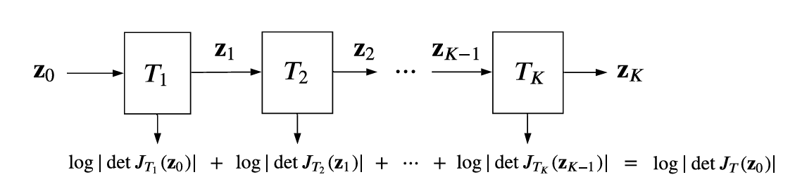

# 链接


- [Flow Matching for Generative Modeling](https://neurips.cc/virtual/2024/tutorial/99531)

- [(3 封私信 / 22 条消息) 通俗易懂的Flow Matching原理解读（附核心公式推导和源代码） - 知乎](https://zhuanlan.zhihu.com/p/4116861550)

- **Diffusion** 就像教一个AI修复老照片。你不断给照片加污渍（前向过程），然后让它学习如何根据当前的破损程度来**预测最初的污渍**（训练），从而一步步地把污渍擦掉（生成）。
- **Flow Matching** 就像教一个AI全局的地形和水流方向。你给出无数个点的例子，告诉它“如果一个水滴在这里，它应该往哪个方向以多快的速度流”（训练）。要生成一个湖泊（数据），你只需要从高处（噪声）放一滴水，它就会沿着学习到的地形（向量场）自动流到湖中（生成）。

- [Flow Matching — Flow Matching documentation](https://facebookresearch.github.io/flow_matching/)


# 演变过程


## AIGC

**AIGC**（**A**rtificial **I**ntelligence **G**enerated **C**ontent，人工智能生成内容）

### GAN 2014

<a href="[[1406.2661\] Generative Adversarial Networks](https://arxiv.org/abs/1406.2661)">arxiv</a>			<a href="[goodfeli/adversarial：论文“Generative Adversarial Networks”的代码和超参数](https://github.com/goodfeli/adversarial)">github</a>		
$$
min_Gmax_DV(D,G)=\mathbb{E_{x\sim P_{data(x)}}}[log D(x)]+\mathbb{E_{z\sim P_{z}(z)}}[log(1-D(G(z)))]
$$

|  符号  |         含义         |
| :----: | :------------------: |
|   G    |    生成器, 印钞机    |
|   D    |    判别器, AI检测    |
|   z    |  噪声(随机高斯噪声)  |
|   x    |       真实数据       |
| p_data | 真实数据概率密度分布 |
| V(D,G) |       价值函数       |

对于AI检测这张是真假钞票, 当然识别到的真钞票(D(x))越大越好, 假钞票(D(G(x)))越小越好

而对于印钞机, 希望骗过检测, 那么肯定希望1-D(G(z))越接近0越好, 那么后面一项就越接近-∞


对于任何一个固定的G，这个最大化问题(最大化价值函数V)的最优解 $D^*_G(x)$ 是：
$$
D^*_G(x)=\frac{p_{data}(x)}{p_{data}(x)+p_g(x)}
$$

#### 训练算法

```pseudocode
对抗生成网络伪代码, k=1, p_g(z): 噪声分布 

for iterations do
	for k steps do
		- 从p_g(z)采样m个噪声样本
		- 从p_data(x)采样m个数据样本
		-  梯度下降算法更新D(下面第一个公式)
	end for
	- 从p_g(z)采样m个噪声样本
	- 更新G(下面第二个公式)
end for
```

$$
\bigtriangledown_{\theta_d}\frac{1}{m}\sum_{i=1}^m[logD(x^{(i)})+log(1-D(G(z^{(i)})))]
$$

$$
\bigtriangledown_{\theta_g}\frac{1}{m}\sum_{i=1}^mlog(1-D(G(z^{(i)})))
$$


### **VAE**

姑且就只说说代码吧, 毕竟VAE我本人从DM中就已经学的差不多了, 直接上手代码了

#### 代码解析

<a href="[learn_vae/VAE/main.ipynb at master · OxOOo/learn_vae](https://github.com/OxOOo/learn_vae/blob/master/VAE/main.ipynb)">code</a>

代码中的步骤为:

1. 图片x映射到隐变量 mu(均值), logvar(方差)

2. 从z = μ (mu)+ ε ⊙ σ(logvar)可知, 

   ```python
   std = torch.exp(0.5 * logvar) # 计算标准差, std = sqrt(var) = sqrt(exp(logvar)) = exp(logvar/2)
   epsilon = torch.randn_like(std, requires_grad=False)
   z=mu + epsilon * std
   ```

   

   1. μ 是编码器输出的均值向量
   2. σ 是编码器输出的标准差向量（通过对数方差logvar计算得到：σ = exp(0.5 * logvar)）
   3. ε 是从标准正态分布 N(0,1) 中采样的随机噪声
   4. ⊙ 表示逐元素相乘（Hadamard积）

3. 将z进行解码得到重构的原图x(recon_x)

4. 计算损失

   1. KL散度: KL(q(z|x) || p(z)) = -0.5 * Σ(1 + log(σ²) - μ² - σ²)

      ```python
      KLD = -0.5 * torch.sum(1 + logvar - mu.pow(2) - logvar.exp())
      ```

      

   2. BCE(重构误差): 计算recon_x和x之间的误差

      ```python
      BCE = binary_cross_entropy(recon_x, x, reduction='sum')
      ```

5. 生成部分: 随机生成一张高斯噪声图, 模型解码之后review

   ```python
   z = torch.randn(6, model.latent_dim).to(device)
   recon_batch = model.decode(z)
   recon_batch = recon_batch.view(-1, 28, 28).cpu().numpy()
   ```

   

### **Diffusion Models**

图片+噪声->纯噪

用训练好的模型一步步去噪->图片

感觉就是多步VAE, 由上一步生成的图片作为下一步输入的图片


<span style="font-size:12px; color:red;font-style:italic;font-weight:bold">扩散模型可以看作是VAE概念的自然延伸和特化，它将VAE的单步潜变量映射扩展为多步的马尔可夫链，通过固定的前向过程(加噪)和可学习的反向过程(去噪)实现高质量生成。</span>


### **Normalizing Flows** | 标准化流

说白了就是, 一个对原始图不断转换的过程




z_0到z_k(假设为x)就是用一系列雅可比矩阵转换, 这个变换的过程就称为流
$$
p_x(x)=p_z(z)\cdot|det(\frac{\partial f(z)}{\partial z})|^{-1}
$$


#### Continuous Normalizing Flows, CNF | 连续归一化流

重在连续, 定义一个速度场, 然后看着点在这个速度场的驱动下，从起始形状平滑、连续地“流动”成最终形状。


# 数学知识


## 常微分方程（ODE）

若未知函数是一元函数的微分方程称为常微分方程(未知函数是**一元函数**（只有一个独立变量）)

### n 阶常微分方程

$$
F(x,y,y',...,y^{(n)})=0
$$


### 偏微分方程(PDE)

未知函数是**多元函数**（有多个独立变量）
$$
\frac{\partial^2 O}{\partial x^2}+\frac{\partial^2 O}{\partial y^2}+\frac{\partial^2 O}{\partial z^2}=0
$$


## 变量变换定理（Change of Variables Formula）

变量变换定理提供了一个公式，用于计算当我们在一个积分中做变量替换时，如何相应地改变被积函数和积分区域。它的核心在于引入了雅可比行列式，用来衡量变换过程中体积的局部伸缩比例。

其实就是改变变量公式其他也要随之改变而已(变量的范围等等), 比如

1. **极坐标** (2D)： `dx dy = r dr dθ`
2. **柱坐标** (3D)： `dx dy dz = r dr dθ dz`
3. **球坐标** (3D)： `dx dy dz = ρ² sinφ dρ dφ dθ`


# Flow Matching

OK, 终于来到了流匹配这一步了😫

经过我这段时间的学习, 了解到FM基本上是Score Match / DM的一种泛化形式, 也就是说Score Match / DM算得上是FM的特殊情况

要想知道公式, 必须知道每个参数的意义是什么

| 参数   | 意义 s                                                       |
| ------ | ------------------------------------------------------------ |
| p(x)   | 数据分布, 数据呈现某种分布的形式                             |
| q(x)   | 先验分布(就是已知的分布数据如: 标准高斯 N(0,I))              |
| t      | 时间[0,1]                                                    |
| x_t    | 在时间t的状态，在某个采样路径上介于噪声和真实数据之间的点    |
| u_t    | t时刻已知的向量场                                            |
| v(x,t) | 网络学习的目标, v->u                                         |
| \phi_t | 流映射, 从初始点到时刻t的映射(ODE的解), 映射函数描述一个点从“初始分布空间”如何演化到“目标分布空间” |


$$
\frac{d}{dt}x_t=\frac{d}{dt}\phi_t(x_0)=v_\theta(\phi_t(x_0),t)\\
\phi_0(x_0)=x_0
$$


## 核心思想


流匹配的核心思想是在给定目标概率路径的情况下，通过回归矢量场来匹配生成的概率路径，而无需模拟整个过程。

其实就是训练一个速度v(有方向和大小), 让他去贴近实际的u(已有的数据)
$$
L_{FM}(\theta)=\mathbb{E}_{t,p_t(x)}||v_t(x;\theta)-u_t(x)||^2
$$
一条需要用到的物理学理论:
$$
\frac{d}{dt}p_t(x)+div(p_t(x)u_t(x))=0\\
div F=\bigtriangledown F=\frac{\partial F_x}{\partial x}+\frac{\partial F_y}{\partial y}+\frac{\partial F_z}{\partial z}
$$


##  三大问题

参考链接: [【AI知识分享】你一定能听懂的扩散模型Flow Matching流匹配基本原理深度解析_哔哩哔哩_bilibili](https://www.bilibili.com/video/BV1Wv3xeNEds/?spm_id_from=333.999.0.0&vd_source=37e31518cc82504f3880acfd557df9ef)


### Q1: 用预测条件向量场可以替代原始的不带条件的向量场

$$
\frac{d}{dt}p_t(x)=\int(\frac{d}{dt}p_t(x|x_1)q(x_1))dx_1=-\int div(p_t(x|x_1)u_t(x|x_1))q(x_1)dx_1\\
=-div(\int u_t(x|x_1)p_t(x|x_1)q(x_1)dx_1)=-div(u_t(x)p_t(x))\\
这里可以得出u_t(x)=\frac{\int u_t(x|x_1)p_t(x|x_1)q(x_1)dx_1}{p_t(x)} (***重要)<--下面需要用到这个等式
$$


### Q2: 如何设计基于条件向量场的损失函数

仿造DM等, 用已知的图片作为条件

因此有u_t(x)用u_t(x|x_1)代替
$$
L_{FM}(\theta)=\mathbb{E}_{t,p_t(x)}||v_t(x;\theta)-u_t(x)||^2
$$

$$
L_{CFM}(\theta)=\mathbb{E}_{t,q(x_1),p_t(x|x_1)}||v_t(x;\theta)-u_t(x|x_1)||^2
$$


CFM 加入q(x_1)，让问题变成了 “先取一个真实样本，再在条件下构造流”


#### 如何证明两个损失函数相等?

由于是更新网络, 即梯度一致, 要使得L\_{FM}与L\_{CFM}等价, 也就是证明两者的梯度一致,
$$
\bigtriangledown_\theta L_{FM}(\theta)=\bigtriangledown_\theta L_{CFM}(\theta)\\
这样子就能对变量\theta的更新规则保持一致
$$

$$
||v_t(x;\theta)-u_t(x)||^2=||v_t(x;\theta)||^2+||u_t(x)||^2-2<v_t(x;\theta),u_t(x)>\\
||v_t(x;\theta)-u_t(x|x_1)||^2=||v_t(x;\theta)||^2+||u_t(x|x_1)||^2-2<v_t(x;\theta),u_t(x|x_1)>\\
因此要证明对变量\theta有影响的部分是梯度一致的, 而没有影响的部分可以直接划走\\
最终变成证明:\\
||v_t(x;\theta)||^2?=||v_t(x;\theta)||^2\\
2<v_t(x;\theta),u_t(x)>?=2<v_t(x;\theta),u_t(x|x_1)>
$$

##### v_t(x;\theta)^2?=v_t(x;\theta)^2

$$
\mathbb{E}_{t,p_t(x)}||v_t(x;\theta)||^2=\int ||v_t(x;\theta)||^2p_t(x)dx\\
=\int\int||v_t(x;\theta)||^2p_t(x|x_1)q(x_1)dx_1dx=\mathbb{E}_{t,q(x_1),p_t(x|x_1)}||v_t(x;\theta)||^2
$$

##### 2<v_t(x;\theta),u_t(x)>?=2<v_t(x;\theta),u_t(x|x_1)>

$$
\mathbb{E}_{t,p_t(x)}<v_t(x;\theta),u_t(x)>=\int<v_t(x;\theta),u_t(x)>p_t(x)dx\\
因为u_t(x)=\frac{\int u_t(x|x_1)p_t(x|x_1)q(x_1)dx_1}{p_t(x)}代入\\
\mathbb{E}_{t,p_t(x)}<v_t(x;\theta),u_t(x)>=\int<v_t(x;\theta),u_t(x)>=\int<v_t(x;\theta),\frac{\int u_t(x|x_1)p_t(x|x_1)q(x_1)dx_1}{p_t(x)}>p_t(x)dx\\
=\int\int<v_t(x;\theta),u_t(x|x_1)p_t(x|x_1)q(x_1)dx_1>dx=\int\int<v_t(x;\theta),u_t(x|x_1))>p_t(x|x_1)q(x_1)dx_1dx\\
=\mathbb{E}_{t,q(x_1),p_t(x|x_1)}<v_t(x;\theta),u_t(x|x_1)>
$$


**因此用条件向量场与原先的向量场预测是一致的**


### Q3: 条件向量场的具体形式是什么(用于code)

#### u_t(x|x_1)要怎么求得?


$$
p_t(x|x_1)=\mathcal{N}(x|\mu_t(x_1),\sigma_t(x_1)^2I) 高斯条件概率分布,有两个条件:\\
1.\ t=0, \mathcal{N}(0,1)
\\
2.\ t=1, \mathcal{N}(x_1,\sigma^2), \sigma趋近于0
\\
x=\psi_t(x_0)=\sigma_t(x_1)x_0+\mu_t(x_1)\\
移项一下就得出:\ x_0=\frac{\psi_t(x_0)-\mu_t(x_1)}{\sigma_t(x_1)}
$$

$$
采样ODE方法, 即\\
u_t(x|x_1)=\frac{d}{dt}\psi_t(x_0)=\sigma_t'(x_1)x_0+\mu_t'(x_1)\\
因为x_0=\frac{\psi_t(x_0)-\mu_t(x_1)}{\sigma_t(x_1)}代入\\
u_t(x|x_1)=\sigma_t'(x_1)*\frac{\psi_t(x_0)-\mu_t(x_1)}{\sigma_t(x_1)}+\mu_t'(x_1)\\
=\frac{\sigma_t'(x_1)}{\sigma_t(x_1)}*(x-\mu_t(x_1))+\mu_t'(x_1)
$$


#### DDPM情况

$$
p_t(x|x_1)=\mathcal{N}(x|\alpha_{1-t}x_1,(1-\alpha_{1-t}^2)I)\\
DDPM中: x_t=\sqrt{\bar{\alpha_{1-t}}}x_0+\sqrt{(1-\bar{\alpha_t})\epsilon}\\
因此\mu_t=\sqrt{\bar{\alpha_{1-t}}}x_0,\sigma_t(x_1)=\sqrt{(1-\bar{\alpha_t})}
$$

所以说DDPM是FM的一种特殊情况


## 最优传输条件

$$
\mu_t(x)=tx_1,\ \sigma_t(x)=1-(1-\sigma_{min})t\\
当\sigma_{min}=0时,\psi_t(x_0)=\sigma_t(x_1)x_0+\mu_t(x_1)=(1-t)x_0+tx_1
$$

$$
此时从噪声x_0到图像x_1会变成一个线性组合
$$

## code

### 2D FM 

$$
step中公式(龙格-库塔)计算方法:
\\
给定ODE：\frac{dx}{dt} = f(t, x)\\

中点法的更新公式：\\
k_1 = f(t, x_t)\\
k_2 = f(t + \frac{h}{2}, x_t + \frac{h}{2} \cdot k_1)\\
x_{t+h} = x_t + h \cdot k_2\\

其中 h = t_{\text{end}} - t_{\text{start}}
$$


```Python
import torch
from torch import nn, Tensor

import matplotlib.pyplot as plt
from sklearn.datasets import make_moons

# model
class Flow(nn.Module):
    def __init__(self, dim: int = 2, h: int = 64):
        super().__init__()
        self.net = nn.Sequential(
            nn.Linear(dim + 1, h), nn.ELU(),
            nn.Linear(h, h), nn.ELU(),
            nn.Linear(h, h), nn.ELU(),
            nn.Linear(h, dim))

    def forward(self, t: Tensor, x_t: Tensor) -> Tensor:
        return self.net(torch.cat((t, x_t), -1))

    def step(self, x_t: Tensor, t_start: Tensor, t_end: Tensor) -> Tensor
    # 这个类实现了中点法（二阶Runge-Kutta方法）来数值求解ODE：
    	"""
    	t_start.view(1, 1): 如果 t_start = 0.5，变成 tensor([[0.5]])
    	.expand(x_t.shape[0], 1)将张量扩展为形状 (x_t.shape[0], 1)
    	
    	example:
                t_start = torch.tensor(0.5)  # 标量张量
                x_t = torch.randn(32, 3, 64, 64)  # 批次大小32的图像数据
                result = t_start.view(1, 1).expand(x_t.shape[0], 1)
                # result.shape: torch.Size([32, 1])
                # result: 32个元素值都是0.5
    	"""
        t_start = t_start.view(1, 1).expand(x_t.shape[0], 1)
		
        # self()=self.forward()
        # 在 PyTorch 中，当你对 nn.Module 实例使用调用语法 ()，它实际上调用的是 forward 方法
        return x_t + (t_end - t_start) * self(t=t_start + (t_end - t_start) / 2, x_t= x_t + self(x_t=x_t, t=t_start) * (t_end - t_start) / 2)
# def step(self, x_t: Tensor, t_start: Tensor, t_end: Tensor) -> Tensor:
#     # 1. 将时间步扩展到整个批次
#     t_start = t_start.view(1, 1).expand(x_t.shape[0], 1)
# 
#     # 2. 计算时间步长
#     h = t_end - t_start  # 步长
# 
#     # 3. 计算k1: f(t_start, x_t)
#     k1 = self(t=t_start, x_t=x_t)
# 
#     # 4. 计算中点状态: x_t + h/2 * k1
#     midpoint_x = x_t + k1 * (h / 2)
#     midpoint_t = t_start + h / 2
# 
#     # 5. 计算k2: f(midpoint_t, midpoint_x)
#     k2 = self(t=midpoint_t, x_t=midpoint_x)
# 
#     # 6. 更新状态: x_t + h * k2
#     return x_t + h * k2


# train
flow = Flow()

optimizer = torch.optim.Adam(flow.parameters(), 1e-2)
loss_fn = nn.MSELoss()

for _ in range(10000):
    """
    成一个包含两个"月牙"形状的二维数据集
    256: 生成256个数据点
	noise=0.05: 添加少量噪声（5%）使数据点略微分散，更接近真实数据
    """
    x_1 = Tensor(make_moons(256, noise=0.05)[0])
    
    # noise
    x_0 = torch.randn_like(x_1)
    # 创建一个形状为 (len(x_1), 1) 的张量
    """
    torch.rand()：均匀分布，[0, 1)
    torch.randn()：标准正态分布，均值0，方差1
    torch.randint()：整数随机数
    torch.rand_like()：生成与输入张量形状相同的随机数
    """
    t = torch.rand(len(x_1), 1)
	
    #  最优传输条件求x_t的值
    x_t = (1 - t) * x_0 + t * x_1
    # 梯度,即x_t对t的导数
    dx_t = x_1 - x_0
    
	
    optimizer.zero_grad()
    # 计算网络模拟的梯度与真实梯度之间的损失
    loss_fn(flow(t=t, x_t=x_t), dx_t).backward()
    optimizer.step()


# sample


x = torch.randn(300, 2)
n_steps = 8
fig, axes = plt.subplots(1, n_steps + 1, figsize=(30, 4), sharex=True, sharey=True)

# 创建一个在区间 [0, 1.0] 上均匀分布的数值序列。
time_steps = torch.linspace(0, 1.0, n_steps + 1)

axes[0].scatter(x.detach()[:, 0], x.detach()[:, 1], s=10)
axes[0].set_title(f't = {time_steps[0]:.2f}')
axes[0].set_xlim(-3.0, 3.0)
axes[0].set_ylim(-3.0, 3.0)

for i in range(n_steps):
    # 计算每一时刻x_t的情况
    x = flow.step(x_t=x, t_start=time_steps[i], t_end=time_steps[i + 1])
    axes[i + 1].scatter(x.detach()[:, 0], x.detach()[:, 1], s=10)
    axes[i + 1].set_title(f't = {time_steps[i + 1]:.2f}')

plt.tight_layout()
plt.show()

```


