## ShaSpec- the first missing modality multi-modal approach 

### 一些要知道的内容

什么是模态？

信息表达的形式，比如用文本或者视频图片之类的表达某个信息

什么是多模态？

多模态指的是数据或者信息的**多种**表现形式

### Abstract

1. 当前的方法在evaluation或者train separate model去处理特定的模态缺失
2. these models（指的是哪些？）致力于处理某个特定的任务(从下文可以看到这个方法在分割/ 分类上面处理的都挺不错的)

***Sha***red-***Spec***ific Feature Modelling 共享特定特征建模

#### 如何做到？

1. ShaSpec is designed to take advantage of all available input modalities during training and evaluation by learning shared and specific features to better represent the input data.  ShaSpec旨在通过***共享学习***（共享参数,共享同一个模型）和***学习特定特征***来更好地表示输入数据，从而在训练和评估期间利用所有可用的输入模态。
2. This is achieved from a strategy that relies on auxiliary tasks based on distribution alignment and domain classification, in addition to a residual feature fusion procedure. 通过依赖于基于分布对齐和域分类的辅助任务以及剩余特征融合过程的策略来实现的。（这里后面可以看到是通过添加了两种新的损失策略来达成的）
3. The design simplicity of ShaSpec enables its easy adaptation to multiple tasks, such as classification and segmentation. ShaSpec的设计简单性（大道至简）使其易于适应多个任务，例如分类和分段

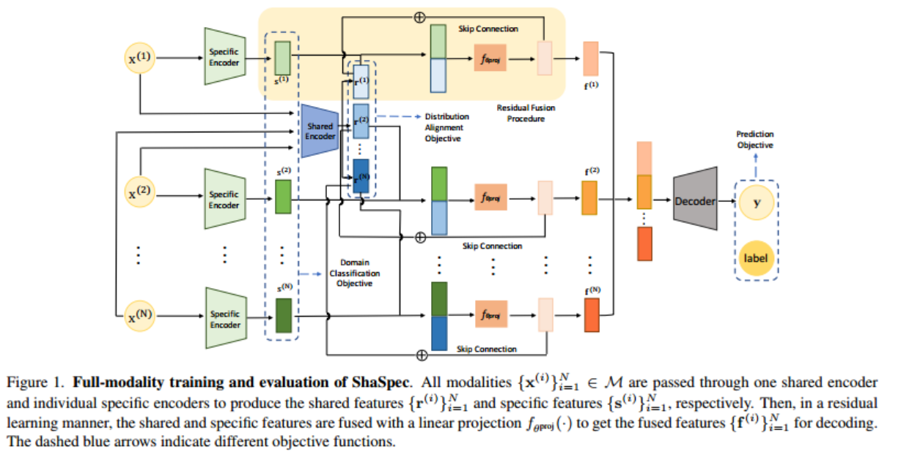

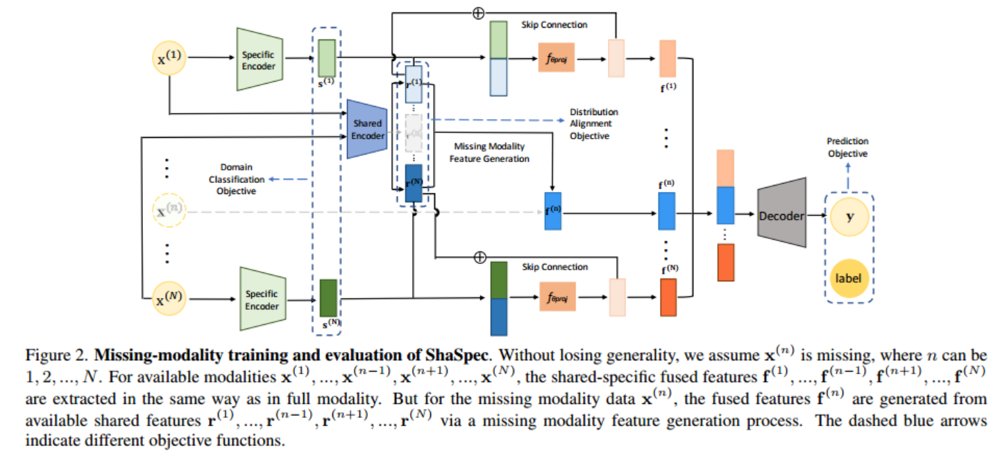

#### note

这两张图的Decoder仅仅用于segmentation

如果要用于classification，融合的特征将被喂给FC层，

#### 作者对这些模块作用的说明

$$
s^{\{i\}}表示的是模态间的异构性，r^{\{i\}}捕捉特征间的一致性
$$

#### 缺失模态的说明

其他地方是一样的，只有对确实模态中的f是直接生成的

$$
假定n是缺失的模态，f^{(n)}=\frac{1}{N-1}\sum_{i=1,i≠n}^Nr^{\{i\}}
$$
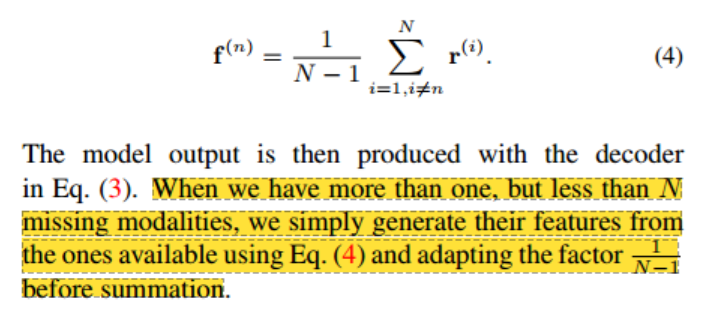

这段话我没搞懂，如果有≥2的模态缺失的话，那应该如何生成，公式4不应该只给出了只缺少其中一种模态的情况吗？

推广到多个模态缺失的公式为：
$$
f^{(n)}=\frac{1}{可用模态数量}\sum_{i=1,i≠n}^Nr^{\{i\}}
$$
就是说其他的缺失模态都会变成相同的值，比如缺失T1和T2,用FL和T1c的平均值来获取，最终T1和T2的值会是相同的

### 训练过程

besides optimising for the main task (segmentation or classification), we introduce two auxiliary tasks, domain classification and distribution alignment, for the learning of the specific and shared feature representations, respectively. 除了对主要任务（分割或分类）进行优化之外，我们还引入了两个辅助任务，域分类和分布对齐，分别用于学习特定和共享特征表示。

文中并没有介绍分割和分类的训练，而是介绍了“Domain Classification Objective”和“ Distribution Alignment Objective”以及“Overall Objective”

#### Domain Classification Objective

we propose to adopt the domain classification objective (DCO) for the specific feature learning. 提出这个阈分类目标用于特定特征学习

$$
L_{dco}(\mathcal{D},\theta^{spec},\theta^{dco})=-\sum_{j=1}^{|\mathcal{D}|}\sum_{i=1}^N(t^{(i)})^{\top}log(f_{\theta^{dco}}(s_j^{(i)}))\\
t^{(i)}\in\{0,1\}^N,其中1是第i个位置，其他都是0，比如说对于Flair模态，它的标签是 [1, 0, 0, 0]；对于T1模态，是 [0, 1, 0, 0]，以此类推。\\
s^{(i)}=f_{\theta^{spec}}^{(i)}(x^{(i)})\\
$$

用于计算特定编码器的损失值，其实感觉就是用于优化Specific Encoder

N：模态总数（4种MRI模态：Flair, T1, T1c, T2）

D：训练数据集
$$
\mathcal{D}=\{(\mathcal{M}_j,y_j)\}_{j=1}^{|\mathcal{D}|}\\
\mathcal{M}_j:第j个训练样本的多模态数据集合，其实就类似于你现有的数据是多少，换个说法就是x
$$

#### Distribution Alignment Objective

$$
L_{dao}(\mathcal{D},\theta^{sha},\theta^{dco})=-\sum_{j=1}^{|\mathcal{D}|}\sum_{i=1}^N(u^{(i)})^{\top}log(f_{\theta^{dao}}(r_j^{(i)}))\\
r^{(i)}=f_{\theta^{sha}}(x^{(i)})
$$

这部分就是用于优化Shared Encoder， 可以从公式7和8看到，这部分其实就是计算

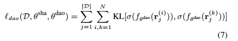

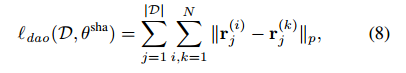

#### Overall Objective*主要

$$
L_{total}(\mathcal{D},\theta^{sha},\theta^{spec},\theta^{proj},\theta^{dao},\theta^{dco},\theta^{dec})=L_{task}(\mathcal{D},\theta^{sha},\theta^{spec},\theta^{proj},\theta^{dec})+\alpha L_{dao}(\mathcal{D},\theta^{sha},\theta^{dao})+\beta L_{dco}(\mathcal{D},\theta^{spec},\theta^{dco})
$$

#### 数据集：

a. **BraTS2018 for medical image segmentation** 

1.  The BraTS2018 Segmentation Challenge dataset [1,21] is used as a multi-modal learning with missing modality brain tumour sub-region segmentation benchmark,  以下三个分割子区域
    1.  where the sub-regions are **enhancing tumour (ET)**
    2.  **tumour core (TC)**
    3.  **whole tumour (WT)**
2.  BraTS2018 contains 3D multi-modal brain MRIs, 数据集包含以下四种模态
    1.  including **Flair,** 
    2.  **T1,** 
    3.  **T1 contrast-enhanced (T1c)** 
    4.  **T2** with experienced imaging experts annotated ground-truth. 

| 参数                                                         | 具体内容                                                     |
| ------------------------------------------------------------ | ------------------------------------------------------------ |
| stochastic gradient descent optimizer                        | Nesterov momentum of 0.99                                    |
| backbone network                                             | **3D UNet**(where the fusion of shared and specific features happens at the bottom of the UNet structure.) |
| learning rate                                                | 0.01 at the beginning and decreased with cosine annealing strategy  余弦退火策略 |
| During the non-dedicated training of models, modalities are randomly dropped to simulate the modality-missing situations. | 在模型的非专用训练期间，模态被随机丢弃以模拟模态缺失的情况。 |
| For dedicated training of models, the missing modalities used for training are the same missing modalities in the evaluation. | 对于模型的专用训练，用于训练的缺失模态与eval中的缺失模态相同。 |
| iterations                                                   | 180,000                                                      |
| distribution alignment objective loss function               | L1 loss                                                      |
| α = 0.1, β = 0.02                                            |                                                              |
| ShaSpec*                                                     | prediction smoothness enhancement 预测平滑增强               |

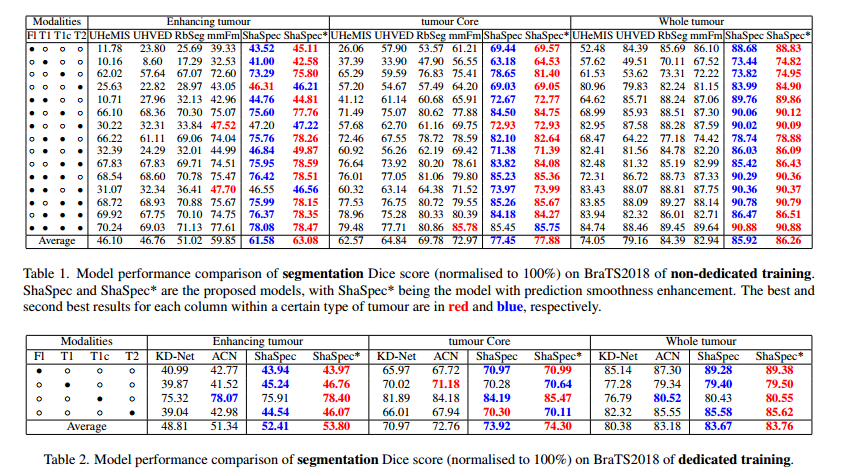

表一是非专用训练的模型（一个模型应对所有的情况），表2是专用训练的模型（多个模型，每个模型应对一种情况）

**这两个模型之间的区别是什么？**模型是一样的，但是**训练策略**不同，

**但是这样子为什么表一和表二在模态相同的情况下，对某个区域进行分割最终输出的结果不同？**解释是说二者所提供的数据其实是不同的（论文是这样子说明的：During the non-dedicated training of models, modalities are randomly dropped to simulate the modality-missing situations. For dedicated training of models, the missing modalities used for training are the same missing modalities in the evaluation.在模型的非专用训练过程中，模态被随机丢弃以模拟模态缺失的情况。对于模型的专用训练，用于训练的缺失模态与评估中的缺失模态相同。）就是说非专用模型用某个模态训练，最终测试的时候可以用任意种模态作为数据输入，而专用训练就是训练和测试的时候数据都是相同的

b. **Audiovision-MNIST for computer vision classification**

1. 音频手写数字集
2. a multi-modal dataset consisting of 1500 samples of audio and image files.
3. 采用和SMIL模型一致的参数
4. 不同的是最后的Decoder是由FC-dropout-FC组成
5. 模型训练使用Adam优化器，权重衰减为10−2，初始学习率设置为10−3（每20个epoch减少10%）

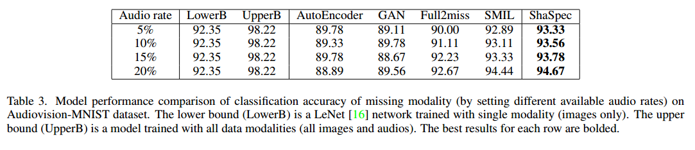

#### 做了一些其他的实验

##### **The selection of DAO loss function**

L1＞KL＞MSE＞CE

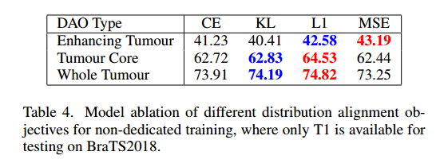

##### **Sensitivity of Eq. (9) to α and β:** 

测试α 时候， β=0.02

测试 β时候，α =0.1

α 和 β都为1的时候，曲线下降的很快，表明辅助损失给太高权重会导致main task梯度流受到干扰

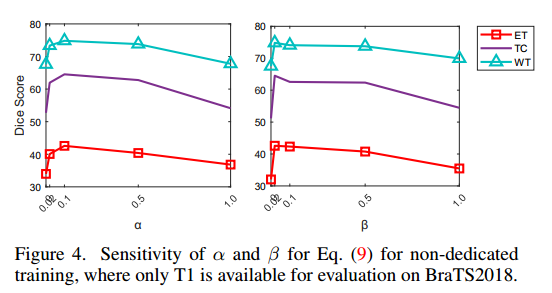

α =0.1，β=0.02是最优解

**Small values for the weights of the auxiliary tasks contribute to the whole process, but do not interfere with the main task optimisation.** Interestingly, when α = 0 (only specific features are learned), the model can still segment the tumours to some extent by simple concatenation of specific features, which means that the specific features contain rich information. A similar conclusion can be reached when β = 0 (only shared features are learned). 这边说辅助分支的权值给的小对整个训练有提升，但并不会影响主任务的优化，当α or β=0时候，模型仍然可以分割目标的特定特征（其实我感觉要是辅助分支对整体的分割都有大的影响，那可能都不是辅助了而是另一个和主模型同等的模型了😂，这段话多少是有点凑字数的感觉了）

##### Computational comparison

we estimate the average time consumption of **30 iterations on one 3090 GPU** for a fair comparison.

|                                   | ShaSpec                                                      | SMIL                                                         |
| --------------------------------- | ------------------------------------------------------------ | ------------------------------------------------------------ |
| training/inference iteration time | takes **0.0257s** for model training iteration and **0.0016s** for model testing | training iterations and testing taking 0.1309s and 0.0019s   |
| GPU memory usage                  | constantly consumes **1421MiB** of GPU memory                | the GPU memory usage started from 1430MiB, climbed to 24268MiB, and then casted an “out of memory” error in the end. |
| batch-size                        | 4                                                            | 4                                                            |
| model parameters                  | **0.22M parameters**                                         | 0.33M parameters                                             |

##### An additional classification experiment on X-ray + clinical texts

（个人觉得可以pass这部分）其实就是在一个临床数据集分类（视觉-文本数据集）上面又做了一次实验

##### Shared and Specific Feature Visualisation

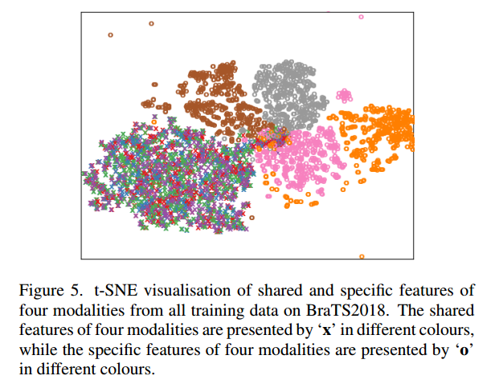

共享特征被聚类在一起，而特定特征被很好地分离

其实我比较好奇这部分作图代码是什么样子的（显然看了代码这部分似乎并没有在内）

## Multi-Modal Modality-Masked Diffusion Network for Brain MRI Synthesis With Random Modality Missing（M2DN） 

### Abstract

1. 现有的医学图像合成生成方法通常基于**获取模态**和**缺失模态**之间的跨模态转变（大概是指的是从当前有的模态中转变到没有的模态）
2. 这些方法（）针对特定的缺失模态并且**一次性**完成合成缺失的模态（不能灵活处理不同的缺失模态的数量，也不能有效的构建跨模态之间的映射（效率低））

a unified Multi-modal Modality-masked Diffusion Network (M2DN), 一种统一的多模态掩蔽扩散网络（”tackling multi-modal synthesis from the perspective of “progressive whole-modality inpainting”从“渐进式全模态图像修复”的角度处理多模态合成，而不是“跨模态转变”）(把缺失的模态当作噪声，通过扩散模型逐步去噪生成)

**STEP:** 

1. 将丢失的模态视为随机噪声，并在每个反向扩散步骤中将所有模态视为一个整体
2. 引入了一种模态掩码方案，将每个传入模态的可用性状态显式编码在二进制掩码中，并将其用作扩散模型的条件，以进一步增强M2DN在任意缺失场景下的合成性能（这段话文中另外一种说法： *以显式地指导模型处理不同的缺失场景*）

### 贡献

Different from the existing models, M2DN employs multi-input multi-output (MIMO) framework based on multitask learning, by which the missing and available modalities are jointly exploited, fused, and synthesized **与现有模型不同，M2DN采用基于多任务学习的多输入多输出（MIMO）框架，通过该框架，缺失模态和可用模态被联合利用、融合和合成**

1. 提出了一个统一的多模态模态掩蔽扩散网络，被称为M2DN，在单个网络内用于合成brain MRI中的随机缺失模态
2. 该方法将所有模态作为一个整体，通过缺失模态合成和可用模态自重构共同完成多模态合成，并基于学习到的公共潜在空间，通过扩散模型从高斯噪声中重绘缺失的模态
3. 引入了一个二进制模态掩码，它嵌入了每个模态的可用性状态，作为每个去噪步骤的条件，这种明确的模态可用性标志可以提高合成效率。
4. 在两个公开的多模态MRI数据集上的实验表明，我们提出的M2DN不仅支持在单个网络中对任意缺失模态进行可靠的合成，而且显着提高了合成性能。

### 方法

#### 前置知识

| 符号              | 含义                                                         |
| ----------------- | ------------------------------------------------------------ |
| M,M^s,M^u         | M是通过不同扫描序列的多模态脑MRI图像，M^s是可提供的模态，M^u是缺失的模态，其中M=M^s+M^u |
| \mathcal{N}       | 高斯分布函数                                                 |
| x_n               | t=n时候的图                                                  |
| \alpha和\beta     | 都是人为定义的参数                                           |
| I                 | 高斯噪声                                                     |
| q和p              | q：前向传播，p：反向去噪生成图像                             |
| \epsilon          | I，高斯噪声                                                  |
| \mu_\theta(x_t,t) | 自定义的一个网络，用于训练一个接近和前向传播的均值网络       |
|                   |                                                              |

$$
\mathcal{N}(x;\mu,\sigma^2),\mu: 均值，\sigma^2：方差\\
q(x_t|x_{t-1})=\mathcal{N}(x_t;\sqrt{1-\beta_t}x_{t-1},\beta_tI)\\
假定：\alpha_t:=1-\beta_t\\
\bar{\alpha_t}:=\prod_{s=1}^t\alpha_s\\
q(x_t|x_0)=\mathcal{N}(x_t;\sqrt{\bar{\alpha_t}}x_0,(1-\bar{\alpha_t})I)\\
$$

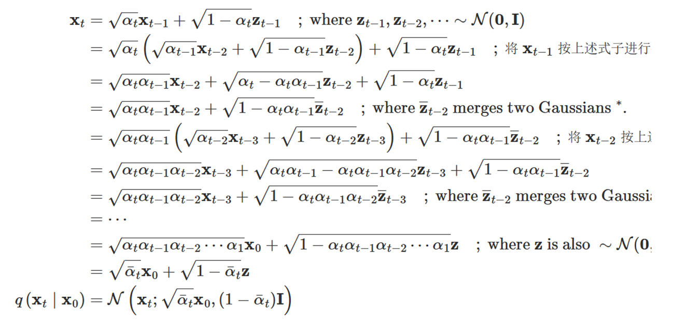

$$
前向传播的逆向：\\
q(x_{t-1}|x_t,x_0)=\int_{x_0}q(x_{t-1}|x_t,x_0)q(x_0|x_t)d{x_0}=
\mathcal{N}(x_{t-1};\tilde{\mu_t}(x_t,x_0),\tilde{\beta}_tI)\\
\tilde{\mu}_t(x_t,x_0):=\frac{\sqrt{\alpha_{t-1}}\beta_t}{1-\bar{\alpha}_t}x_0+\frac{\sqrt{\alpha_t}(1-\bar{\alpha}_{t-1})}{1-\bar{\alpha}_t}x_t\\
\tilde{\beta}_t:=\frac{1-\bar{\alpha}_{t-1}}{1-\bar{\alpha}_t}\beta_t\\
由于前向过程的方差\beta_t直接取常数，因此最后反向过程直接和前向传播的\beta设置成一个值了\\
因为要使得q(x_T|x_0)与p(x_T)=\mathcal{N}(x_T;0,I)的KL散度越小，即让两者相等就有x_0=\frac{x_t-\sqrt{1-\bar{\alpha}_t}\epsilon}{\sqrt{\bar\alpha}_t}\\
最后采样的目的就是训练一个网络\mu_\theta(x_t,t)（自定义的一个网络）使其与\tilde{\mu}_t(x_t,x_0)的距离非常小，就有L_t=E_q[\frac{1}{2\sigma^2_t}||\tilde\mu(x_t,x_0)-\mu_\theta(x_t,t)||^2]+C\\
将x_0和\tilde{\mu}_t(x_t,x_0)代入，就有\mu_\theta(x_t,t)=\frac{1}{\sqrt{\alpha_t}}(x_t-\frac{\beta_t}{\sqrt{1-\bar{\alpha_t}}}\epsilon_\theta(x_t,t))+\sigma_tI=\tilde\mu(x_t,\frac{x_t-\sqrt{1-\bar{\alpha}_t}\epsilon}{\sqrt{\bar\alpha}_t}),发现除了\epsilon之外其他都是既定的参数\\
也就是说最终的训练目标是训练一个网络\epsilon_\theta使其预测前向传播所加噪的噪声\\
即最终的训练为：L(\theta):=E_{t,x_0,\epsilon}[||\epsilon-\epsilon_\theta(\sqrt{\bar{\alpha}_t}x_0+\sqrt{1-\bar{\alpha}_t}\epsilon,t)||^2]\\
即最终的采样为：x_{t-1}=\frac{1}{\sqrt{\alpha_t}}(x_t-\frac{\beta_t}{\sqrt{1-\bar{\alpha_t}}}\epsilon_\theta(x_t,t))+\sigma_tI
$$
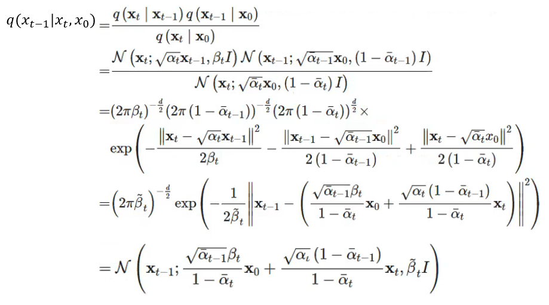

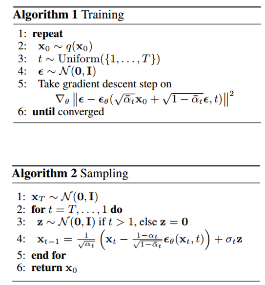

### 网络结构

1. 用高斯噪声初始化缺失的模态
2. 将缺失模态编码为1，可用模态编码为0（modality-mask scheme模态掩码方案：为了更好的处理任意模态缺失的场景，同时作为条件极大的传递了可用性状态给diffusion-base M2DN）

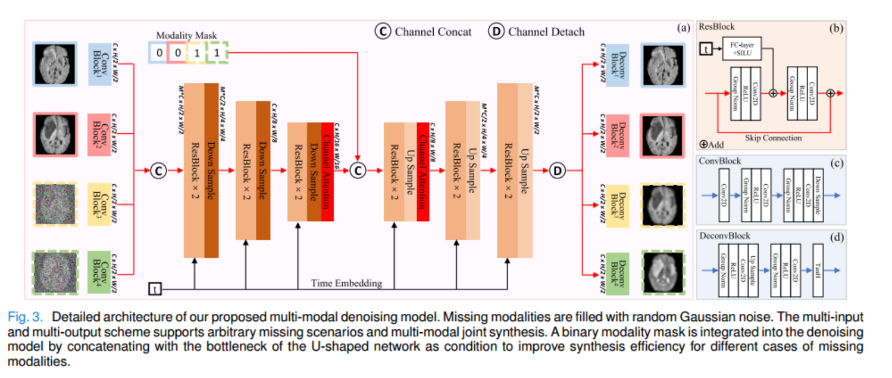

1. 每个模态通过单独的编码器提取特征，然后连接并且转到多模态融合模块中（where the multi-modal information is exchanged and integrated.）
2. “3 × 3 Conv（stride of 2）+GroupNorm+ReLU” 
3. Encoder：  “ResBlock+bilinear downsampling” ， Decoder：“ResBlocks+upsampling”
4. Channel Attention：J. Hu, L. Shen, and G. Sun, “Squeeze-and-excitation networks,” in Proc. IEEE/CVF Conf. Comput. Vis. Pattern Recognit., Jun. 2018, pp. 7132–7141.（SE）
5. unpool这个二值模态掩码将其从M X 1 X 1 -> M X 16 X 16 (分配相同的值从1X1到16X16), 这样子的话，尺寸为M × 16 × 16的未合并的二进制掩模可以与尺寸为128 × 16 × 16的U形多模态融合块在通道维度上的瓶颈特征级联。

#### Multi-Modal Joint Synthesis：不仅合成缺失的模态，而且合成已有模态

相比于创新点来说就是原来都是只合成缺失的模态，这里两种情况都合成

前面一大段话夸了一下我们的模型非常nice

然后说明在前向过程中，只对缺失的模态进行diffusion，*（我不明白这里为什么只写一个diffusion，到底是加噪还是做了什么其他操作，模态不是缺失了吗，图像哪里来？**以下是询问DeepSeek的答案**，也就是说一开始图像都是有的，只是对需要缺失的模态进行了加噪，然后不需要缺失的模态不进行加噪）*，可用模态不做处理

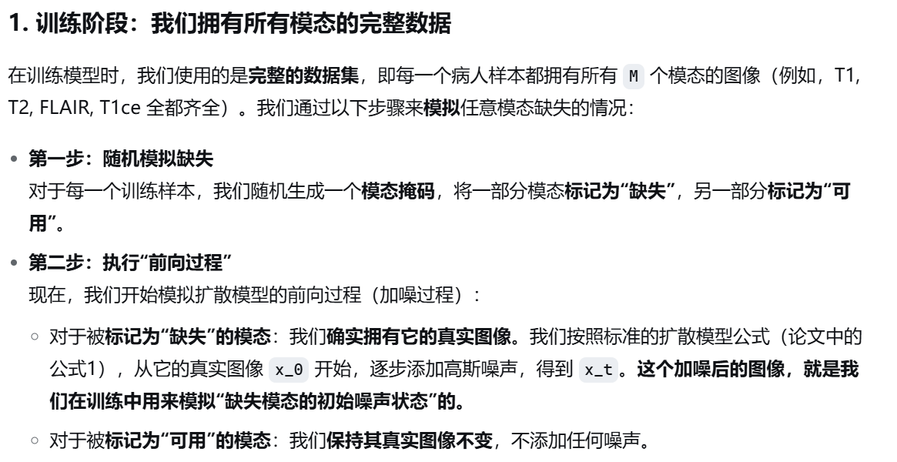

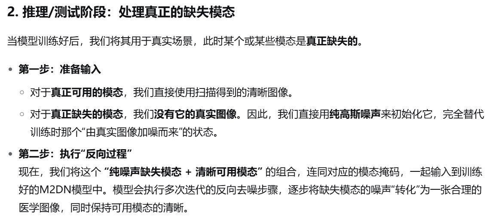

在反向过程中，可用模态两个用途：1. 作为条件 recover the **diffused** modalities （这个diffused到底是表达什么，答：**已经通过前向过程被噪声污染后的状态**） 2. perform self-supervised representation learning 

**note：** the self-reconstructed available modalities are not used as input for the next denoising step.自我重构的可用模态并不被用作下一个去噪步骤的输入，也就是说每一个去噪步骤的可用模态都是一开始就提供好的图像了

#### Modality-Mask Scheme

作用： 为了使M2DN更有效地适应各种情况下丢失的模态，我们引入了一个模态掩码方案，通过二进制向量显式编码模态可用性状态。

**In the training phase,** all the possible divisions between available and missing modalities are considered, which corresponds to all the reasonable possibilities of the binary vector, except all ones or all zeros cases。在训练阶段，考虑可用模态和缺失模态之间的所有可能划分，这对应于二进制向量的所有合理可能性，除了全1或全0的情况（这段话是什么意思？难道不应该是把缺失的模态划分为1，存在的模态划分为0，但是为什么考虑所有的可能性？答：这里就对应于我刚才在Multi-Modal Joint Synthesis说明的情况了（一开始图像都是有的，只是对需要缺失的模态进行了加噪，然后不需要缺失的模态不进行加噪），因此考虑所有情况，**在训练过程中，会随机地、反复地模拟每一种可能出现的缺失情况**）

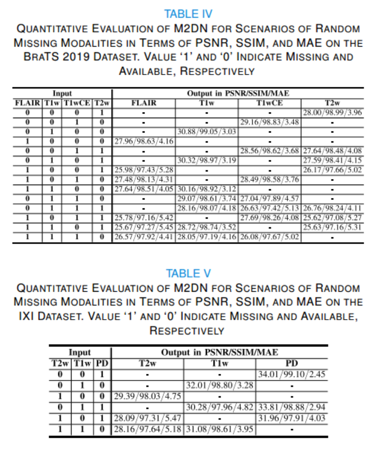

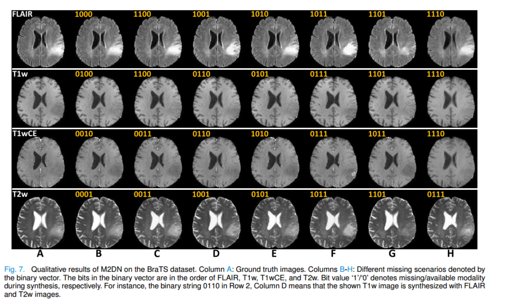

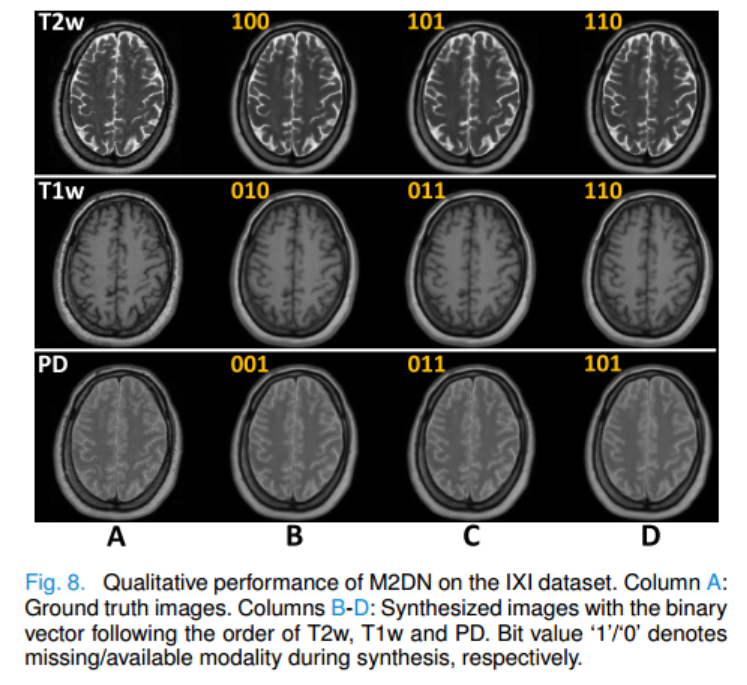

**In the inference phase,** the binary vector is constructed according to input images, and serves as explicit guidance for the reverse diffusion process. 在推理阶段，根据输入图像构造二进制向量，并用作反向扩散过程的显式指导。（把缺失的模态划分为1，存在的模态划分为0）

#### 消融实验

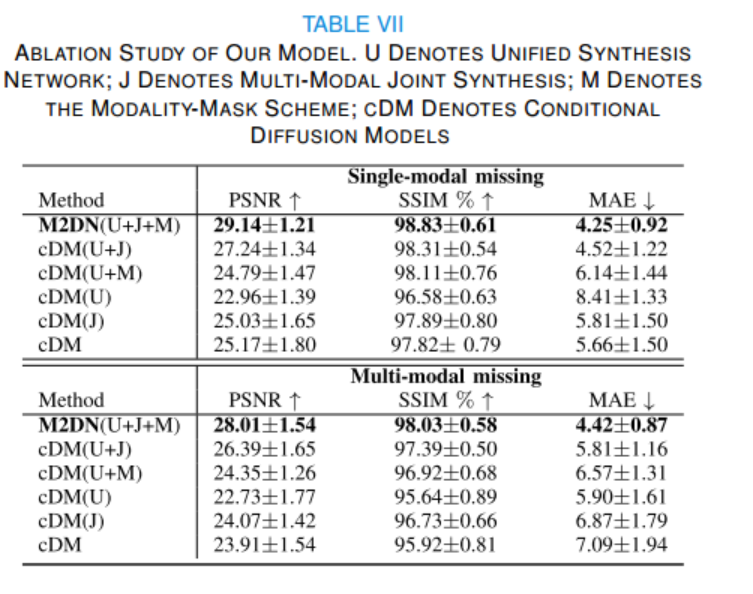

U+J+M：完整模型

U+J: 去掉 Modality-Mask Scheme

U+M：去掉Multi-Modal Joint Synthesis

U:没有Modality-Mask Scheme以及joint synthesis（这个和cDM的区别是什么？），这个是当前的模型，但是只生成缺失的模态以及没有使用模态掩码策略

J：仅仅Multi-Modal Joint Synthesis

cDM：传统的条件扩散模型，为特定缺失场景单独训练

#### Loss Function

$$
L_{M2DN}=||\mathcal{M}-f_\theta(\mathcal{M}_t,t,v)||^2\\
v指的是模态掩码
$$

since we add noise only to the missing modalities, not the observed ones in the diffusion process, performing self-reconstruction for observed modalities in the reverse diffusion step turns out to be more informative and effective than predicting zero noise for establishing common latent space. To maintain consensus between available and missing modalities, similarly, we estimate images, instead of noise, also for the missing modalities. 由于我们只对缺失模态添加噪声，而不是在扩散过程中对可用模态添加噪声，因此在反向扩散步骤中对可用模态执行自重建比预测零噪声以建立公共潜在空间更有信息量和有效性（这段话是什么意思，损失函数到底是针对哪部分？是针对去噪过程中对加噪的缺失模态进行损失计算，那么未加噪的图像是如何进行损失的？）**结论是： 与原始的Diffusion的损失不同，这部分是对图像进行损失，即模型输出的图像与真实图像进行损失计算，并不对噪声进行预测和损失计算**

#### 数据集

两个公共多模态脑MRI数据集：IXI（T1w, T2w, and PD-weighted (PD).） 和 BraTS-2019 （T1w, T1wCE, T2w, and FLAIR）

We also apply the paired Wilcoxon signed-rank test with confidence interval p < 0.05 on the evaluation metric to statistically demonstrate the superiority of our M2DN compared to the other state-of-the-art methods. “我们采用了**配对Wilcoxon符号秩检验**这一统计方法，以**每个测试样本为单位**，严谨地比较了我们的M2DN模型与其他先进方法在各个评估指标（如PSNR、SSIM）上的表现。我们将显著性水平设定为 `p < 0.05`。检验结果证实，M2DN的性能提升在统计学上是**显著的**，这意味着我们的模型确实优于其他方法，而这种优势极不可能是由偶然因素造成的。”（这实验666）

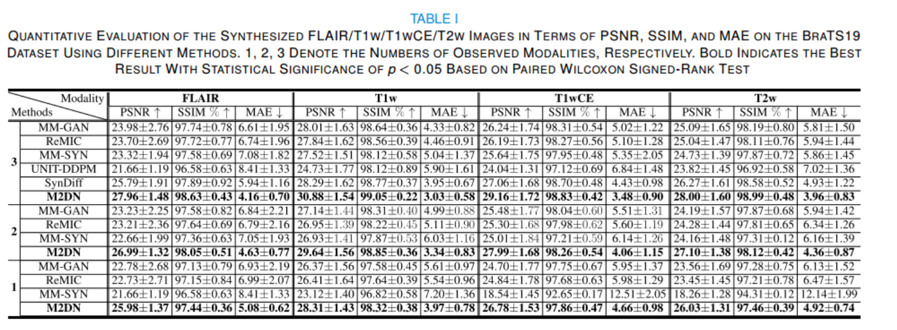

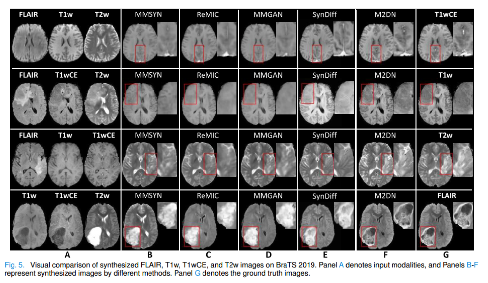

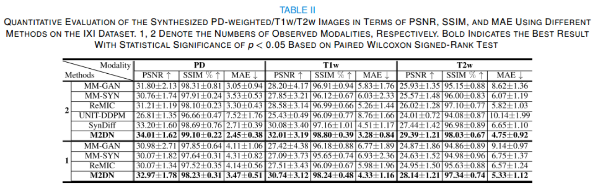

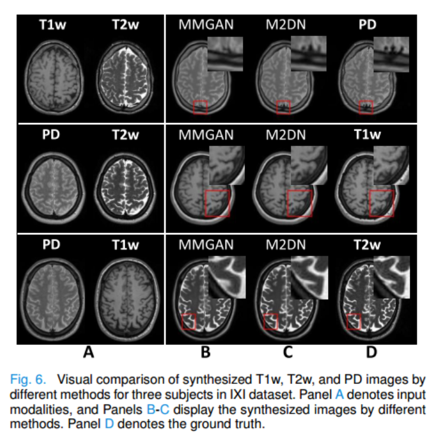

**模型内存与推理时间**

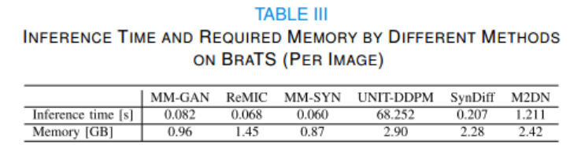

**Tumor Segmentation**

将模型用于下游任务中

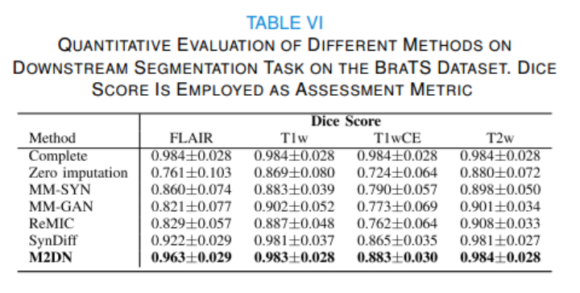

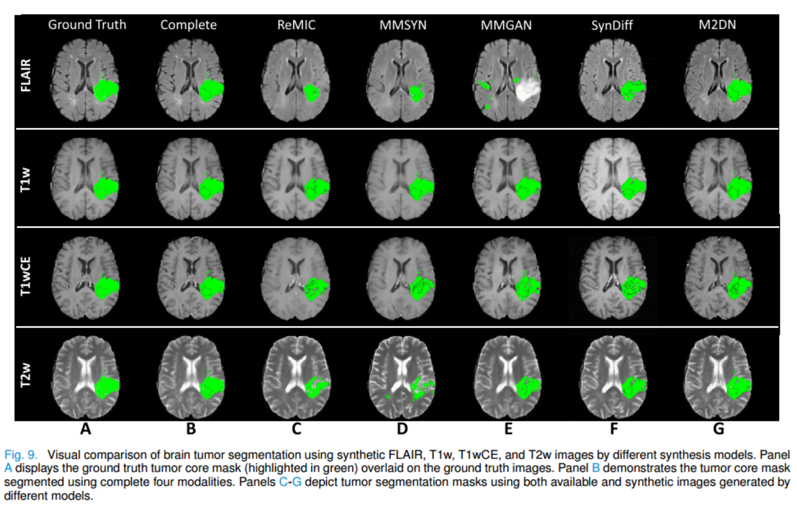

